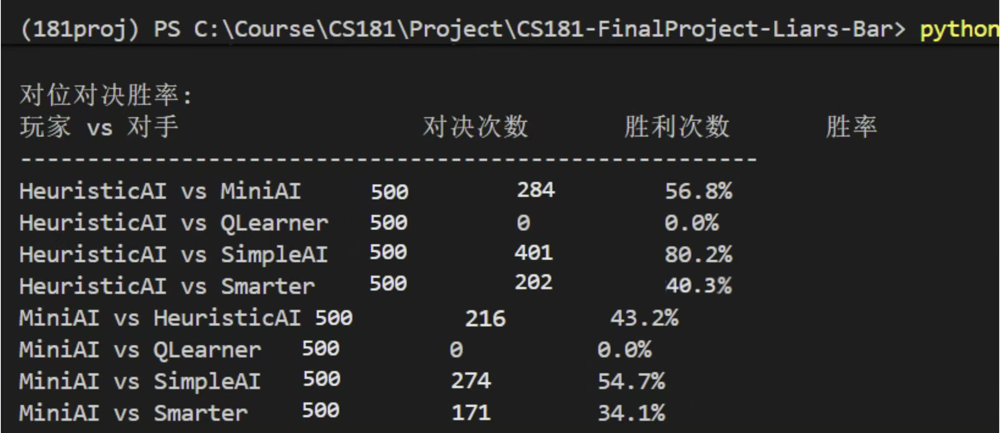
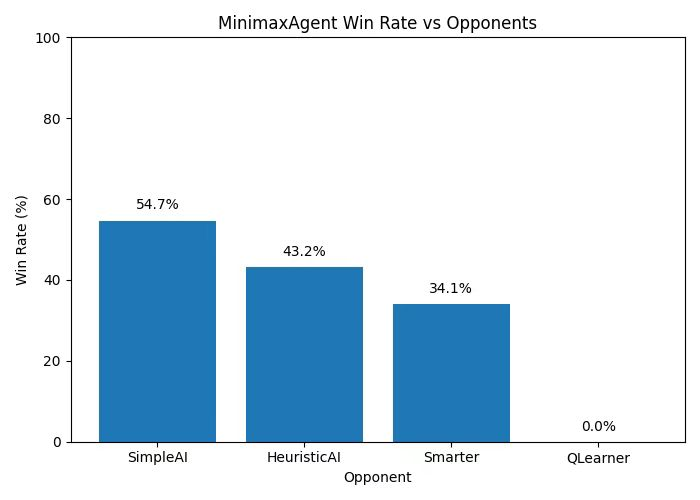
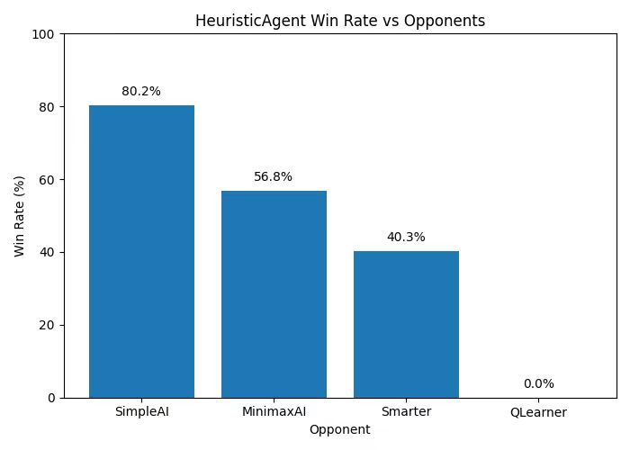

<!-- 添加两栏布局样式 -->

<!-- 建议：把这段 style 放到全局（文件最开头的某一页前），后面所有两栏页都能用 -->

# Play LiarsBar with AI Agent

目标：构建 **humanlike** 智能体，并系统对比 RL / 搜索 / 启发式方法

> 小组成员：刘一多 王昱杰 刘佩坤 考梓逸 陈安宁

---
# 一、游戏框架搭建

## 游戏简介：Liars Bar（骗子酒馆）

- 回合制对抗：玩家需要 **出牌** 并可在特定阶段选择 **质疑**，如果质疑失败，质疑方受惩罚；如果质疑成功，被质疑方受惩罚。
- 关键特点  
  - **不完全信息**：对手手牌不可见，声明可能为真也可能为假  
  - **心理博弈**：虚张声势、试探、反质疑  
  - **风险机制**：与“子弹位置/惩罚”相关（高风险决策）

---

## 框架来源与改编点

- 原项目：LYiHub/liars-bar-llm: 一个由大语言模型驱动的AI版骗子酒馆对战框架
- 我们的改编重点
  - 统一 **agent 接口**：便于接入 RL / Minimax / Heuristic / 规则玩家
  - 增设 **humanlike 玩家建模**
  - 设计 **状态编码与特征工程** 支持学习型策略

---

## Player 设计（重点：Humanlike）

对比三类玩家策略（从“机械”到“拟人”）：

1) **Simple**
- 只会质疑 & 只出真牌

2) **Smarter**
- 固定概率质疑（随机但不随局势变化）& 优先出joker，其次是真牌

3) **Humanlike**
- **随机性**：同一状态不总是同一动作（避免“脚本感”）
- **适应性**：根据对手的 cheat/challenge 倾向改变策略
- **风险意识**：结合“子弹位置/局势压力”调整激进程度
- **心理建模**：把对手行为当作可学习信号

---

# Agent Player 设计

### Minimax（简化版）
- 动作空间：4 种  
  - 不出牌 / 出 1 真 / 出 2 真 / 出 1 假
- 近似模拟：
  - 自己出牌：从手牌删除
  - 对手回合：`opponent_hand_size -= 1`（近似对手出 1 张）
- 标准 Minimax 搜索决策

### Heuristic（固定策略打分）
- 枚举若干出牌策略（1真/2真/1假）
- 用 `heuristic()` 打分，选择最高分策略

---

## 为什么 Minimax/Heuristic 在此受限？

- **Minimax 更适合完全信息博弈**（棋类等）  
  在骗子酒馆中：
  - 对手手牌未知、声明真假不可知
  - 状态只能“假设”推演 → 误差累积
  - 若扩展真实状态/动作 → 计算爆炸

- **Heuristic**：
  - 依赖人为定义状态好坏与规则
  - 难覆盖复杂局势，缺乏学习能力，策略显得“呆板”

---
## 强化学习建模：State / Feature / Action / Reward

- **State**：环境的状态空间（结构化字典）
- **Feature**：从 state 提取的人工特征向量（使用固定维数便于输入神经网络学习）
- **Action**：出牌动作 + 质疑动作（One-Hot）
- **Reward**：以对局结果为主导（引导最优策略）

---

## State 定义（核心字段）

状态字典包含（出牌阶段/质疑阶段略有差异）：

- `round_id`：轮次
- `target_card`：目标牌（Q/K/A）
- `current_bullet`：当前子弹位置
- 手牌计数：`q_count, k_count, a_count, joker_count`
- `target_count`：可当作目标牌的数量
- `hand_size`：手牌总数
- 质疑阶段特有：`claimed_cards`（对手声称出的张数）
- `opponent_features`：对手特征（cheat/challenge/aggression/confidence）

---

## Feature extraction（共 19 维）

<!-- 左栏：前4类特征 -->
1) **轮次**：`round_id`（1）  
2) **目标牌 one-hot**（3）  
3) **子弹位置**（3）  
   - `current_bullet`  
   - `6 - current_bullet`  
   - `is_start = (current_bullet==0)`  
4) **目标牌充足程度**（3）  
   - `target_count`  
   - `target_count / hand_size`  
   - `has_target`  

<!-- 右栏：后4类特征 -->
5) **手牌大小**（2）  
   - `hand_size`  
   - `is_empty`  
6) **Joker**（2）  
   - `joker_count`  
   - `has_joker`  
7) **质疑相关**（1）：`claimed_cards`  
8) **对手特征**（4）：cheat / challenge / aggression / confidence  

---

## Action 空间设计（One-Hot）

- 出牌动作：**N 维**（“可能出牌模板集合”）
- 质疑动作：**2 维**
  - `challenge`
  - `no_challenge`

总动作空间：`N + 2`

> 设计原则：
- 固定模版：出牌动作 N 维（“可能出牌模板集合”）+ 质疑动作 2 维
- 可约束（将非法动作mask，从而确定legal actions）

---

## Reward 设计（以对局结果为主）

- 主要奖励来自 **胜负/存活/惩罚结果**
  reward shaping：
  - 合理质疑成功/本轮存活：正奖励
  - 错误质疑/高风险动作最终失败：负奖励
  - 过度保守导致被动：轻微负奖励

---
## LinearQAgent：线性函数逼近 Q-Learning

**核心思想**：用线性函数逼近动作价值函数，将状态映射为特征向量 $\phi(s)$。

  

### 1) 线性 Q 函数
$$
Q(s,a)=w_a^\top \phi(s)
$$

### 2) $\varepsilon$-greedy 动作选择
$$
a_t=
\begin{cases}
\arg\max_a Q(s_t,a), & \text{prob. } 1-\varepsilon \\
\text{random action}, & \text{prob. } \varepsilon
\end{cases}
$$

  

  

### 3) Q-learning 的 TD 目标与更新
$$
y_t=r_t+\gamma \max_{a'} Q(s_{t+1},a')
$$

$$
\delta_t = y_t - Q(s_t,a_t)
$$

$$
w_{a_t} \leftarrow w_{a_t} + \alpha \, \delta_t \, \phi(s_t)
$$

-  快、可解释、对小样本友好  
- 表达能力有限，复杂心理博弈易欠拟合

  

---
## DQN：Q-Learning + 深度网络

**核心思想**：用深度网络 $Q(s,a;\theta)$ 近似最优 Q 函数。

  

### 1) Q 网络近似
$$
Q(s,a;\theta)\approx Q^\*(s,a)
$$

### 2) Target Network（稳定 TD 目标）
$$
y_t = r_t + \gamma \max_{a'} Q(s_{t+1},a';\theta^-)
$$

### 3) 损失函数（最小化 TD 误差）
$$
\mathcal{L}(\theta)=\mathbb{E}\Big[(y_t - Q(s_t,a_t;\theta))^2\Big]
$$

  

  

### 4) Experience Replay（经验回放）
从回放池 $\mathcal{D}$ 随机采样训练：
$$
(s_t,a_t,r_t,s_{t+1}) \sim \text{Uniform}(\mathcal{D})
$$

- Replay：打破序列相关性  
- Target：训练更稳定  
- $\varepsilon$-greedy：探索/利用平衡

  

---

# 实验结果

---
  **Minimax**：由于minimax算法的计算复杂度较高，若对局玩家数量较多，分支过于庞大，计算时间会较长。
  - 单挑对手：simple，heuristic，smarter，qlearner
  
---
  **Heuristic**：由于其策略较简单，计算复杂度低，在单轮游戏中表现良好。
  - 对手：simple，smarter，humanlike
  

---

# 遇到的挑战与解决思路

## 实验对比与发现：DQN 过拟合玩家顺序

问题：
- DQN 在训练中对“玩家顺序/固定对手行为”出现过拟合  
- 表现为：在训练时我们没有考虑过变换对手顺序对训练结果的影响，直到在某次eval时偶然间交换了对手顺序后，发现胜率明显下降。这提醒我们模型可能对玩家顺序产生了过拟合。

---

## 解决思路：引入全局信息 + 概率编码心理特征（解决过拟合）

- 我们为了模拟人类的决策，只给agent提供了受限视角的**局部信息**，几乎没考虑其他玩家的状态（那些和玩家强绑定的状态由于规则限制，用处很小），这导致了模型对玩家顺序的过拟合。
- 那么，我们想到在训练时每隔一个epoch就随机打乱重排一次玩家顺序，接着将 **全局历史信息**（所有玩家之前出牌、质疑信息）纳入观察，对玩家行为模式做 **概率编码** ，形成对对手的**心理侧写**，并加入特征集：  
  - cheat_rate / challenge_rate / aggression / confidence
- **评估阶段**：回到真实的**局部可观测**设置，但保留对手偏好统计 → 用“对手画像”辅助决策。

**效果**
- 从“记顺序”转为“**学动机/行为模式**”，**顺序过拟合**显著缓解，对不同玩家次序的**泛化更好**
---

---

## 总结与后续方向

已完成：
- 框架改编与 agent 接口统一
- humanlike 玩家设计与特征工程
- LinearQAgent / DQN / Minimax / Heuristic 对比
- 解决 DQN 玩家顺序过拟合：全局信息 + 心理概率特征

后续可做：
- 更强的对手建模（Bayesian 统计进行对手行为预测）
- 更细粒度 reward shaping 与行为约束（更拟人、更稳）
- rl 玩家策略的可解释性：
  - 分析模型学到的 Q 函数，理解其行为模式，验证是否与**专家经验**相符。

---

Reference：
- LYiHub/liars-bar-llm: 一个由大语言模型驱动的AI版骗子酒馆对战框架
  - https://github.com/LYiHub/liars-bar-llm

---

# Q & A
谢谢！
